# ⚛️ Tokamak — Simulatore di un reattore a fusione

[](https://github.com/lorenzomonti/Tokamak/actions/workflows/ci.yml)


> Simulatore **end-to-end** della fisica, dell'ingegneria e del controllo di un
> tokamak (reattore a fusione), costruito dai principi primi e validato contro i
> parametri di ITER.

**Domanda guida:** un plasma D-T a una data densità, temperatura e qualità di
confinamento, produce più energia di quanta ne serva per restare caldo? E la
macchina che lo contiene, regge?

Il progetto parte dalla reattività nucleare e arriva a un simulatore integrato:
trasporto del calore, vincoli ingegneristici, controllo in retroazione,
combustione auto-consistente, equilibrio magnetico 2D, ottimizzazione, un
emulatore ML e un kernel C++ — il tutto con una rete di **74 test di
validazione fisica** e una dashboard interattiva.

### Cosa dimostra questo progetto

- **Fisica del plasma**: reattività, bilancio di potenza, criterio di Lawson,
  equilibrio MHD (Grad-Shafranov), combustione e radiazione.
- **Metodi numerici**: PDE di diffusione (schema implicito a volumi finiti),
  solver ellittici sparsi, integrazione di ODE, ottimizzazione vincolata.
- **Ingegneria del reattore**: limiti operativi (Greenwald, Troyon, divertore),
  ciclo del combustibile e tritium breeding.
- **Teoria del controllo**: regolatori PID/PD, saturazione, anti-windup,
  reiezione del disturbo, stabilizzazione di un sistema instabile.
- **Machine learning**: surrogate model (processo gaussiano) del solver.
- **Software/HPC**: pacchetto testato, CI, kernel **C++** con pybind11,
  dashboard **Streamlit**.

### Indice

[Galleria & fisica](#la-fisica-in-breve) ·
[Validazione](#validazione) ·
[Struttura](#struttura-del-progetto) ·
[Uso](#uso) ·
[Dashboard](#dashboard-interattiva) ·
[Roadmap](ROADMAP.md) ·
[Riferimenti](#riferimenti)

## Cosa c'è dentro (fasi)

- ✅ **Fase 1 — Modello 0D**: reattività D-T, bilancio di potenza, fattore di
  guadagno *Q* e criterio di Lawson.
- ✅ **Fase 2 — Trasporto radiale 1D**: equazione di diffusione del calore,
  solver implicito a volumi finiti, profilo *T(r)* e *τ_E* emergente.
- ✅ **Fase 3 — Vincoli ingegneristici**: densità di Greenwald, beta limit di
  Troyon, carico termico sul divertore, diagramma dello spazio operativo.
- ✅ **Fase 4A — Controllo in retroazione**: regolatore PID (con saturazione e
  anti-windup) che regola il riscaldamento per mantenere la temperatura al
  target, con reiezione del disturbo di confinamento.
- ✅ **Fase 5 — Equilibrio di Grad-Shafranov (2D)**: solver ellittico a
  differenze finite (algebra sparsa + iterazione di Picard), superfici
  magnetiche annidate e shift di Shafranov.
- ✅ **Fase 6 — Combustione auto-consistente**: evoluzione temporale accoppiata
  di combustibile D-T, cenere di elio ed energia; accensione (ignition) e
  avvelenamento da cenere (Z_eff).
- ✅ **Fase 7 — Radiazione da impurità**: Z_eff da miscela, funzione di
  raffreddamento (~Z³) e soglia di collasso radiativo per specie.
- ✅ **Fase 8 — Ottimizzazione del punto operativo**: massimizzazione vincolata
  (SLSQP) della potenza di fusione sotto i limiti di Greenwald e Troyon.
- ✅ **Fase 9 — Controllo di stabilità verticale**: stabilizzazione PD del plasma
  allungato (verticalmente instabile), con reiezione del disturbo.
- ✅ **Fase 10 — Ciclo del combustibile**: consumo e breeding del trizio,
  bilancio dell'inventario, TBR di autosufficienza e doubling time.
- ✅ **Fase 11 — Emulatore ML**: surrogate model (processo gaussiano) addestrato
  sul solver di trasporto; predice τ_E e T₀ con speed-up ~75×.
- ✅ **Fase 12 — Dashboard interattiva**: app Streamlit che integra tutte le fasi
  con slider sui parametri macchina e aggiornamento dal vivo dei grafici.
- ✅ **Fase 4B — Kernel C++**: solutore tridiagonale di Thomas in C++ (pybind11)
  come backend alternativo del solver di trasporto, con benchmark vs scipy.

Vedi [ROADMAP.md](ROADMAP.md) per il piano completo.

## La fisica in breve

Il modello confronta densità di potenza (W/m³) prodotte e perse in un plasma
D-T 50:50:

| Termine | Significato | Scaling |
|---|---|---|
| `P_fus` | Potenza di fusione D-T → ⁴He + n | ∝ n²⟨σv⟩ |
| `P_α` | Self-heating delle particelle alfa (resta confinato) | ≈ P_fus / 5 |
| `P_brem` | Perdita per radiazione di Bremsstrahlung | ∝ n²√T |
| `P_loss` | Perdita per trasporto, `W/τ_E` | ∝ nT/τ_E |

La **reattività** ⟨σv⟩(T) è calcolata come media maxwelliana della sezione
d'urto di Bosch-Hale, validata contro i valori di letteratura (entro ~2% tra 1 e
200 keV, picco a ~66 keV).

### Criterio di Lawson

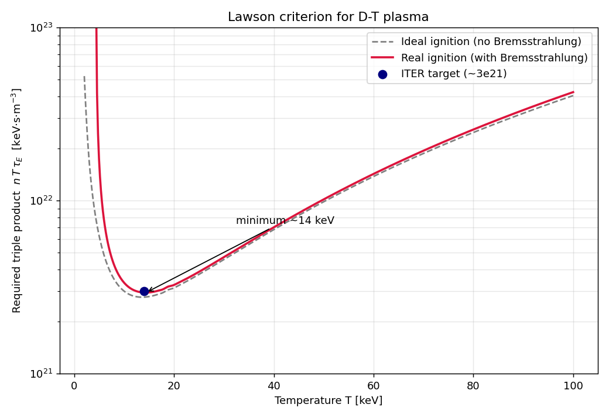

Il triplo prodotto `n·T·τ_E` richiesto per l'ignition ha un **minimo a ~14 keV**:
è la finestra operativa ottimale del D-T. Sotto una temperatura minima il
Bremsstrahlung domina la fusione e l'ignition diventa impossibile a qualunque
densità (la curva rossa diverge).

### Trasporto radiale 1D

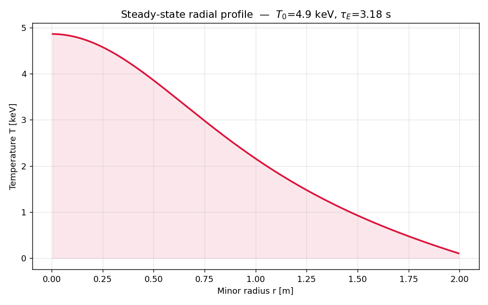

Risolviamo l'equazione di diffusione del calore lungo il raggio minore con uno
schema implicito a volumi finiti (sistema tridiagonale, algoritmo di Thomas):

```
(3/2) n ∂T/∂t = (1/r) ∂/∂r( r·nχ·∂T/∂r ) + S(r)
```

A differenza del modello 0D, il tempo di confinamento `τ_E` non è imposto ma
**emerge** dal profilo calcolato, dalla diffusività `χ` e dalla geometria.
Validazione numerica: confronto con la soluzione analitica parabolica (sorgente
e `χ` costanti) e conservazione dell'energia a dominio isolato.

### Spazio operativo (vincoli ingegneristici)

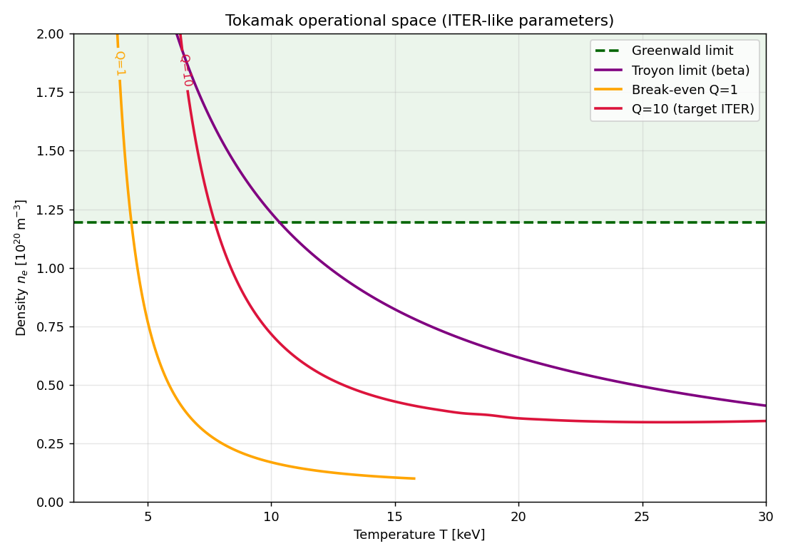

Un reattore deve stare dentro tre limiti fisico-ingegneristici:

| Limite | Formula | Cosa impedisce |
|---|---|---|
| Greenwald | `n_G = I_p / (π a²)` | disruption da densità eccessiva |
| Troyon (beta) | `β_max[%] = β_N·I_p/(a·B_t)` | instabilità MHD da pressione eccessiva |
| Divertore | `q = P_SOL / A_bagnata` | fusione dei materiali (~10 MW/m²) |

La finestra operativa utile è la regione che soddisfa **tutti** i vincoli ed è
sopra la curva di break-even — intorno a 10–15 keV per parametri tipo ITER.

### Controllo in retroazione (PID)

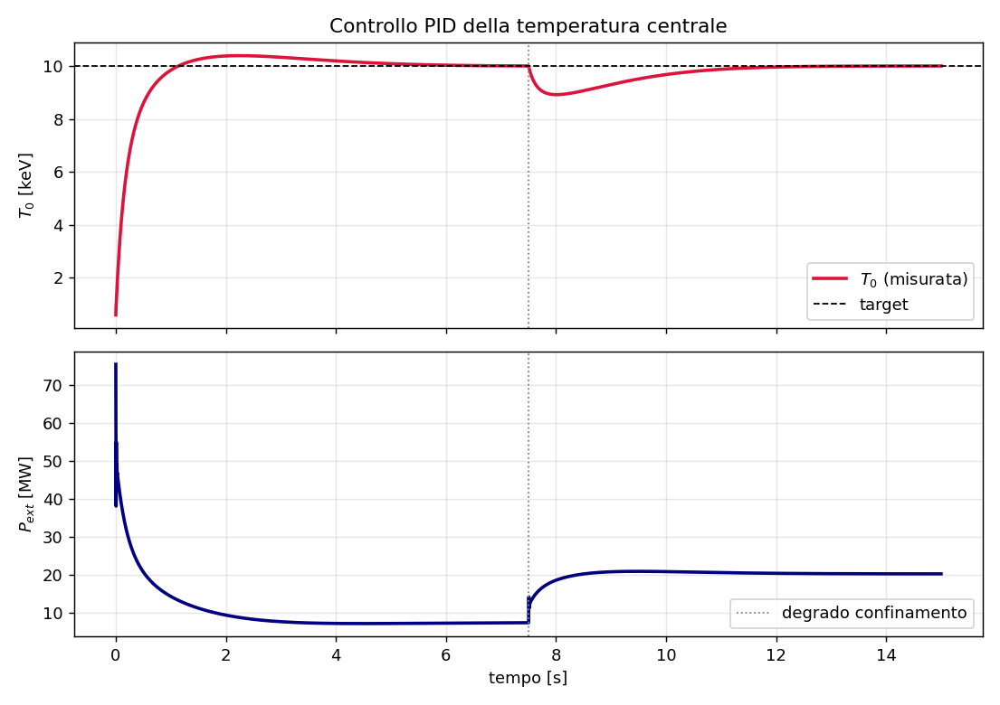

Un regolatore PID regola la potenza di riscaldamento `P_ext` per mantenere la
temperatura centrale a un target:

```
P_ext(t) = Kp·e(t) + Ki·∫e dt + Kd·de/dt,   e = T_target − T
```

Con saturazione (`0 ≤ P_ext ≤ P_max`) e anti-windup, come ogni controllore
reale. La demo mostra la **reiezione del disturbo**: a metà simulazione il
confinamento si degrada (χ raddoppia), la temperatura cala e il controllore
alza la potenza per riportarla al target.

### Equilibrio magnetico di Grad-Shafranov

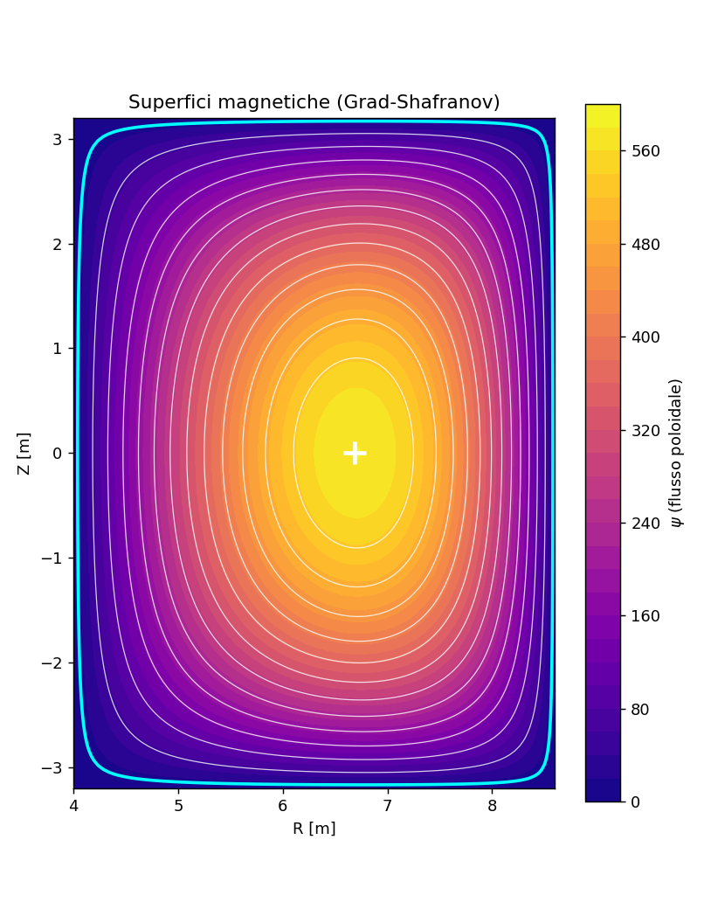

Risolve l'equazione di equilibrio MHD assialsimmetrica per la funzione di flusso
poloidale `ψ(R,Z)`:

```
Δ*ψ = −μ0 R² dp/dψ − F dF/dψ
```

con un solver ellittico a differenze finite (matrice sparsa) e iterazione di
Picard sul termine non lineare. Il bordo del plasma è prescritto a forma di **D**
(elongazione κ, triangolarità δ — ciò che fanno le bobine di sagomatura). Le
curve di livello di `ψ` sono le superfici magnetiche annidate; l'asse magnetico
risulta spostato verso l'esterno (shift di Shafranov). Validato contro una
soluzione analitica polinomiale (Solov'ev).

### Combustione auto-consistente

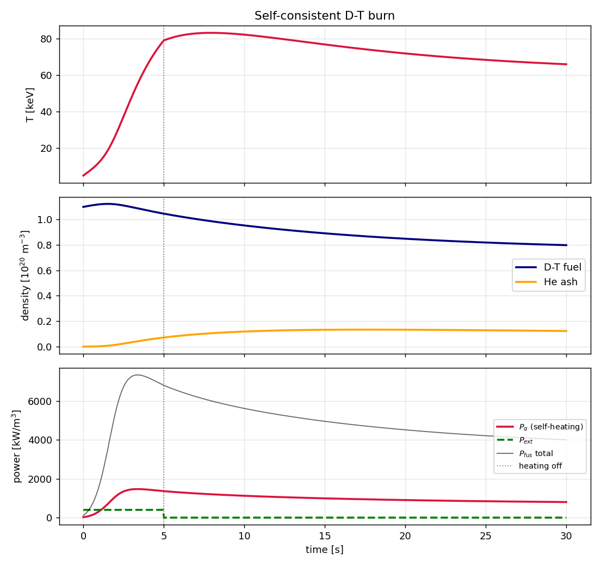

Modello 0D dipendente dal tempo che evolve insieme combustibile, cenere ed
energia:

```
dn_DT/dt = S_fuel − 2R      dn_He/dt = R − n_He/τ_p
dU/dt    = P_α + P_ext − P_brem − U/τ_E
```

La demo mostra l'**accensione**: dopo lo spegnimento del riscaldamento esterno
il self-heating delle alfa sostiene la combustione. Nel tempo il combustibile si
consuma e la cenere di elio si accumula, alzando `Z_eff` e le perdite — un
effetto che solo un modello dinamico cattura. Test di conservazione:
`Δn_He = −½ Δn_DT` (un elio per reazione, due nuclei di combustibile consumati).

### Radiazione da impurità e collasso radiativo

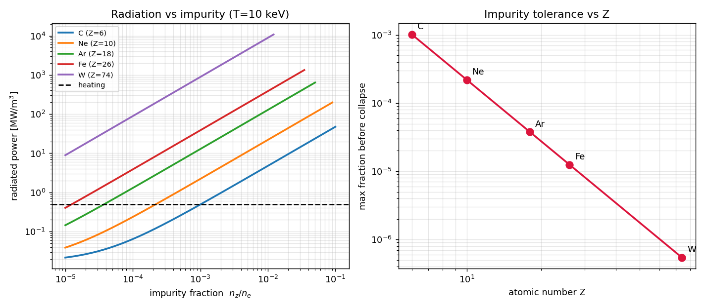

Le impurità irraggiano per radiazione di linea, `P_line = n_e·n_z·L_z(T)`, con
la funzione di raffreddamento che scala circa come `L_z ~ Z³`. Quando la
radiazione supera il riscaldamento, la temperatura collassa. Il modello mostra
che il tungsteno (Z=74) è tollerato solo a livello di **ppm**, mentre il
carbonio fino a ~0.1% — il motivo per cui le impurità ad alto Z sono temute.

> ⚠️ La funzione di raffreddamento `L_z(T)` qui è **schematica** (scaling Z³
> calibrato, non dati ADAS): riproduce il fenomeno, non valori quantitativi.

### Ottimizzazione del punto operativo

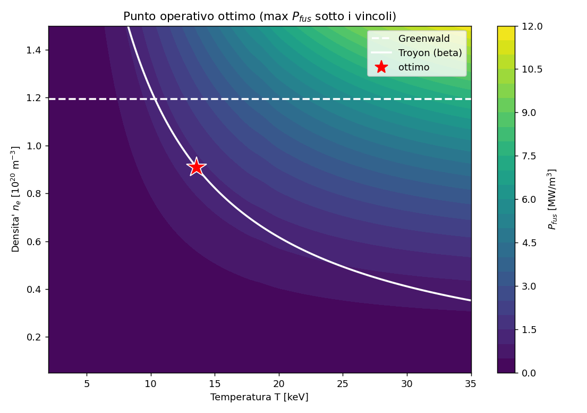

Massimizza la densità di potenza di fusione `P_fus(n,T)` sotto i vincoli di
Greenwald e Troyon (SLSQP). L'ottimo cade sul **bordo dei vincoli** — qui sul
limite di Troyon a ~13.6 keV — perché `P_fus ∝ n²⟨σv⟩` cresce con densità e
temperatura. È la sintesi quantitativa di fisica (fusione) e ingegneria (limiti).

### Controllo di stabilità verticale

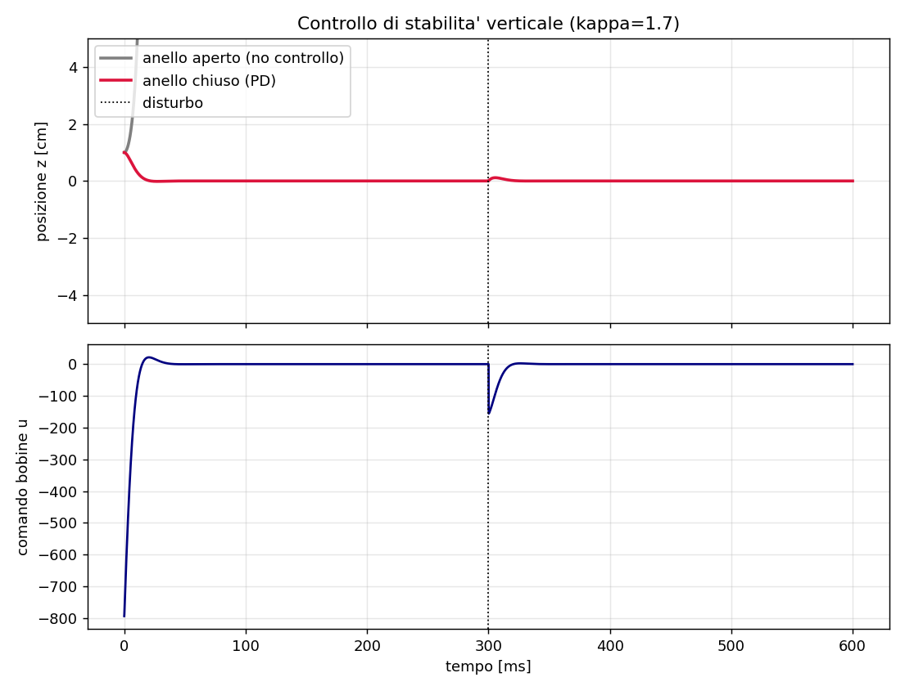

I plasmi allungati (κ>1, forma a D) confinano meglio ma sono **verticalmente
instabili** (pendolo inverso, `z̈ = γ²z + bu`). Senza controllo fuggono verso la
parete in pochi ms; un controllore **PD** (lo stesso `PIDController` con kᵢ=0) li
stabilizza se `b·kp > γ²`. La demo confronta anello aperto (fuga) e anello chiuso
(stabilizzato + reiezione di un disturbo impulsivo).

### Ciclo del combustibile (trizio)

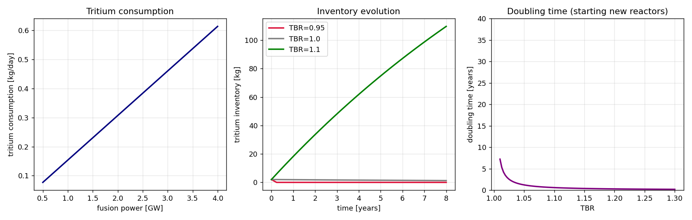

Il trizio non esiste in natura: va prodotto nel mantello di litio. Un reattore
da ~3 GW ne brucia ~0.5 kg/giorno, quindi serve `TBR = prodotto/consumato > 1`
per l'autosufficienza. Il bilancio `dN/dt = (TBR−1)·burn − λN + S` mostra che
solo con TBR>1 l'inventario cresce; il doubling time (per avviare nuovi reattori)
diverge quando TBR→1.

### Emulatore ML del solver (surrogate model)

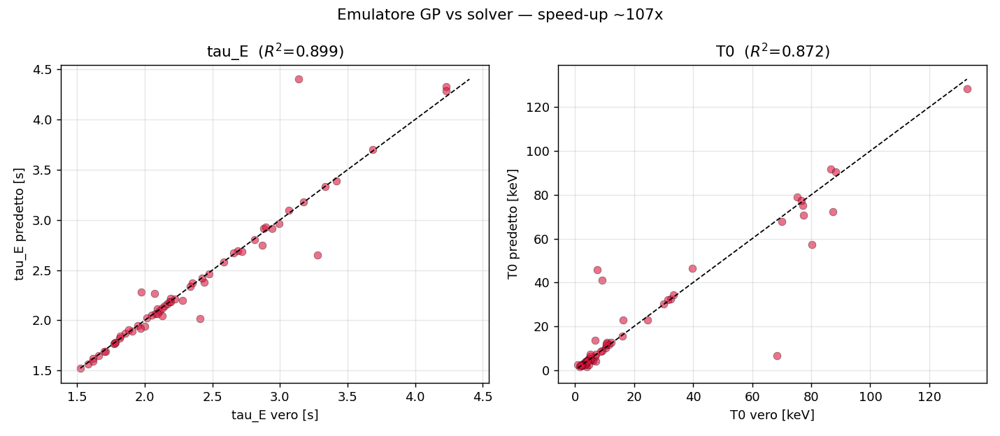

Un modello di machine learning (processo gaussiano) addestrato sui dati del
solver 1D impara la mappa `(n_e, χ, P_ext) → (τ_E, T₀)` e la predice in
millisecondi (speed-up **~75×**), con R² ≈ 0.9 su dati mai visti. È il pattern
"physics + ML": un emulatore veloce per scan massicci o controllo in tempo
reale. Gli scostamenti maggiori sono nei rari casi vicini all'ignition (mappa
molto ripida).

### Kernel C++ ad alte prestazioni (pybind11)

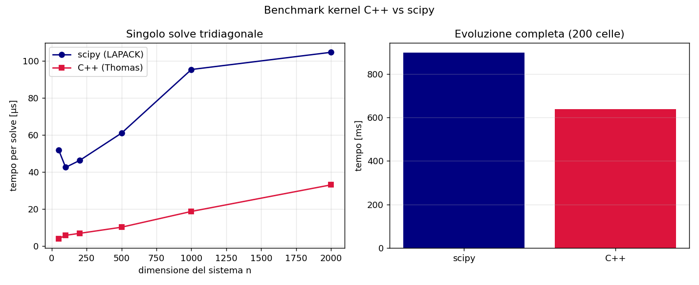

Il solutore tridiagonale al cuore dello schema implicito è riscritto in **C++**
(algoritmo di Thomas) ed esposto a Python con **pybind11**, come backend
alternativo (`TransportSolver1D(..., backend="cpp")`). Risultati misurati:

- **Singolo solve**: il C++ è **3–13× più veloce** di `scipy.solve_banded` — il
  solutore bandato *generico* di LAPACK ha un overhead che il Thomas
  *specializzato* evita (vantaggio massimo sui sistemi piccoli).
- **Evoluzione completa**: solo **~1.4×**, perché il solve è solo una frazione
  del costo per passo (legge di Amdahl): la soluzione tridiagonale non è il
  collo di bottiglia dell'intero step.

Il kernel C++ è **opzionale**: senza compilarlo, il pacchetto usa scipy. Build:

```bash
pip install -e ".[cpp]"                  # aggiunge pybind11
python setup_cpp.py build_ext --inplace  # compila tokamak._tridiag_cpp
python notebooks/cpp_benchmark.py
```

## Validazione

| Grandezza | Modello | Riferimento |
|---|---|---|
| ⟨σv⟩ a 10 keV | 1.14e-22 m³/s | ~1.1e-22 m³/s |
| Picco di ⟨σv⟩ | 66 keV | ~64 keV |
| Minimo del triplo prodotto | 14.4 keV | ~14 keV |
| Frazione alfa | 0.200 | 3.52/17.59 = 0.200 |

## Uso

```bash
python -m venv .venv && source .venv/bin/activate
pip install -e ".[dev]"

# Punto d'ingresso unico: esegue tutte le fasi (e, con --test, anche i test)
python main.py --test        # test + tutte le fasi (genera le figure in docs/)
python main.py               # solo le fasi (figure)
python main.py --phase 1 5   # solo le fasi indicate
python main.py --only-test   # solo i test (74)

# In alternativa, i singoli script:
pytest
python notebooks/lawson_diagram.py
python notebooks/radial_profile.py
python notebooks/operational_space.py
python notebooks/control_demo.py
python notebooks/flux_surfaces.py
python notebooks/burn_demo.py
python notebooks/radiative_collapse.py
python notebooks/optimum_demo.py
python notebooks/vertical_control.py
python notebooks/fuel_cycle_demo.py
python notebooks/surrogate_demo.py   # genera un dataset col solver (lento la 1ª volta)
```

### Dashboard interattiva

```bash
pip install -e ".[app]"     # aggiunge streamlit
streamlit run dashboard.py  # apre l'app nel browser
```

L'app integra tutte le fasi: slider su corrente, campo, densità, χ, riscaldamento,
TBR… con grafici (spazio operativo + ottimo, profilo radiale, combustione, ciclo
del trizio) aggiornati dal vivo.

<!-- Suggerimento: cattura uno screenshot dell'app e salvalo come
     docs/dashboard.png, poi mostralo qui:   -->

```python
from tokamak import fusion_gain_Q

# Q in stato stazionario per parametri tipo ITER
Q = fusion_gain_Q(n_e=1.0e20, T_keV=15.0, tau_e=2.0)
```

## Struttura del progetto

```
Tokamak/
├── src/tokamak/            # pacchetto: un modulo per dominio fisico
│   ├── reactivity.py         # <σv>(T) — media maxwelliana della sezione d'urto
│   ├── power_balance.py      # bilancio 0D, Q, criterio di Lawson
│   ├── transport.py          # diffusione del calore 1D (implicita, volumi finiti)
│   ├── engineering.py        # limiti di Greenwald, Troyon, divertore
│   ├── control.py            # regolatore PID (saturazione + anti-windup)
│   ├── equilibrium.py        # equilibrio 2D di Grad-Shafranov
│   ├── burn.py               # combustione D-T auto-consistente + cenere He
│   ├── radiation.py          # radiazione da impurità, Z_eff, collasso radiativo
│   ├── optimization.py       # ottimizzazione vincolata del punto operativo
│   ├── stability.py          # stabilità verticale e suo controllo
│   ├── fuel_cycle.py         # consumo e breeding del trizio
│   ├── surrogate.py          # emulatore ML (processo gaussiano)
│   └── _tridiag.cpp/.py      # kernel C++ (Thomas) + wrapper, via pybind11
├── tests/                  # 74 test di validazione fisica e numerica
├── notebooks/              # script che generano le figure in docs/
├── docs/                   # figure (gallery del README)
├── dashboard.py            # app interattiva Streamlit
├── main.py                 # punto d'ingresso unico (fasi + test)
└── setup_cpp.py            # build dell'estensione C++
```

## Riferimenti

- H.-S. Bosch & G.M. Hale, *Improved formulas for fusion cross-sections and
  thermal reactivities*, Nucl. Fusion **32** (1992) 611.
- J. Wesson, *Tokamaks*, Oxford University Press.
- J. Freidberg, *Plasma Physics and Fusion Energy*, Cambridge University Press.

## Licenza

MIT
