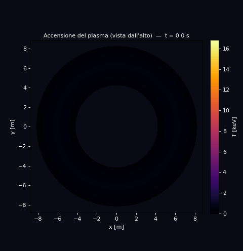
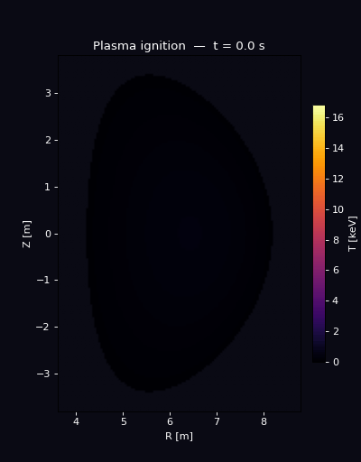
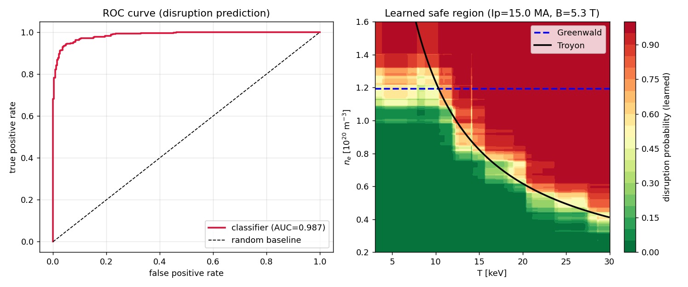
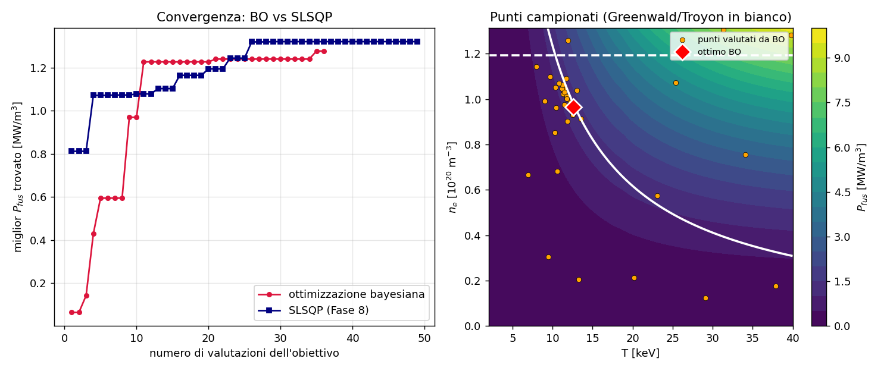
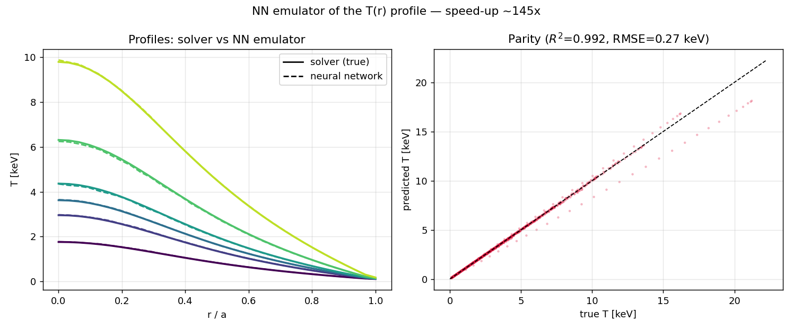
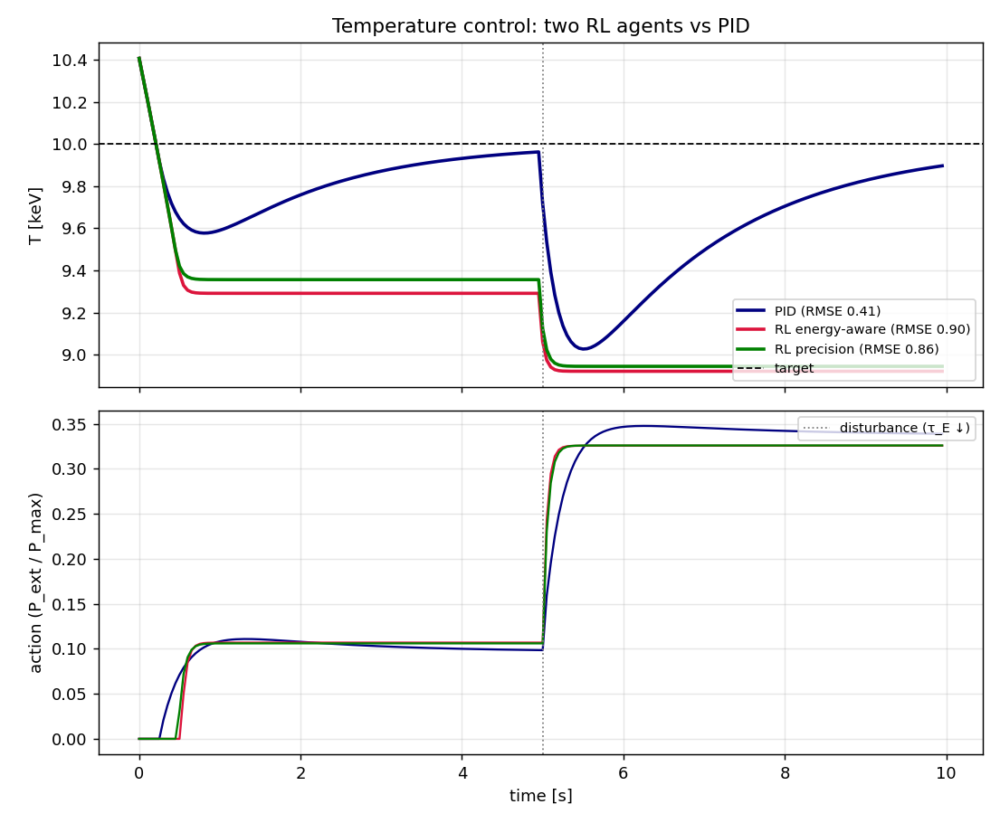

# ⚛️ Tokamak — Fusion reactor simulator

[](https://github.com/LoreMonti/Tokamak/actions/workflows/ci.yml)


> An **end-to-end** simulator of the physics, engineering and control of a
> tokamak (fusion reactor), built from first principles and validated against
> ITER parameters.

<p align="center">
  
  &nbsp;&nbsp;
  
</p>

<p align="center"><sub>Plasma ignition in two views: left, the <b>top view</b>
(toroidal plane — the ring with the central "donut" hole); right, the
<b>poloidal cross-section</b> (vertical D-shaped slice, the bright center is the
magnetic axis). The 1D temperature profile (Phase 2) is mapped onto the magnetic
surfaces of the Grad-Shafranov equilibrium (Phase 5). Reduced model, for
illustration.</sub></p>

**Guiding question:** does a D-T plasma, at a given density, temperature and
confinement quality, produce more energy than it takes to stay hot? And does the
machine that contains it survive?

The project starts from nuclear reactivity and builds up to an integrated
simulator: heat transport, engineering limits, feedback control, self-consistent
burn, 2D magnetic equilibrium, optimization, an ML emulator and a C++ kernel —
all backed by **93 physics-validation tests** and an interactive dashboard.

### What this project demonstrates

- **Plasma physics**: reactivity, power balance, Lawson criterion, MHD
  equilibrium (Grad-Shafranov), burn and radiation.
- **Numerical methods**: diffusion PDE (implicit finite-volume scheme), sparse
  elliptic solvers, ODE integration, constrained optimization.
- **Reactor engineering**: operational limits (Greenwald, Troyon, divertor),
  fuel cycle and tritium breeding.
- **Control theory**: PID/PD controllers, saturation, anti-windup, disturbance
  rejection, stabilization of an unstable system.
- **Machine learning**: surrogate models, classification, Bayesian optimization,
  deep learning, reinforcement learning.
- **Software/HPC**: tested package, CI, **C++** kernel via pybind11, **Streamlit**
  dashboard.

### Contents

[Gallery & physics](#the-physics-in-brief) ·
[Validation](#validation) ·
[Structure](#project-structure) ·
[Usage](#usage) ·
[Dashboard](#interactive-dashboard) ·
[Roadmap](ROADMAP.md) ·
[References](#references)

## What's inside (phases)

- ✅ **Phase 1 — 0D model**: D-T reactivity, power balance, fusion gain $Q$ and
  the Lawson criterion.
- ✅ **Phase 2 — 1D radial transport**: heat diffusion equation, implicit
  finite-volume solver, profile $T(r)$ and emergent $\tau_E$.
- ✅ **Phase 3 — Engineering limits**: Greenwald density, Troyon beta limit,
  divertor heat load, operational-space diagram.
- ✅ **Phase 4A — Feedback control**: PID controller (with saturation and
  anti-windup) that regulates heating to hold the target temperature, with
  rejection of a confinement disturbance.
- ✅ **Phase 5 — Grad-Shafranov equilibrium (2D)**: finite-difference elliptic
  solver (sparse algebra + Picard iteration), nested magnetic surfaces and the
  Shafranov shift.
- ✅ **Phase 6 — Self-consistent burn**: coupled time evolution of D-T fuel,
  helium ash and energy; ignition and ash poisoning ($Z_\text{eff}$).
- ✅ **Phase 7 — Impurity radiation**: $Z_\text{eff}$ from a mixture, cooling
  function ($\sim Z^3$) and radiative-collapse threshold per species.
- ✅ **Phase 8 — Operating-point optimization**: constrained maximization (SLSQP)
  of fusion power under the Greenwald and Troyon limits.
- ✅ **Phase 9 — Vertical stability control**: PD stabilization of the elongated
  (vertically unstable) plasma, with disturbance rejection.
- ✅ **Phase 10 — Fuel cycle**: tritium consumption and breeding, inventory
  balance, self-sufficiency TBR and doubling time.
- ✅ **Phase 11 — ML emulator**: surrogate model (Gaussian process) trained on the
  transport solver; predicts $\tau_E$ and $T_0$ with ~75× speed-up.
- ✅ **Phase 12 — Interactive dashboard**: Streamlit app integrating all phases
  with sliders on the machine parameters and live-updating plots.
- ✅ **Phase 4B — C++ kernel**: Thomas tridiagonal solver in C++ (pybind11) as an
  alternative backend for the transport solver, benchmarked against scipy.
- ✅ **Phase 13 — Disruption prediction (ML)**: classifier (gradient boosting)
  that predicts whether an operating point is stable or disrupts; "rediscovers"
  the safe region from data alone (ROC-AUC ≈ 0.99).
- ✅ **Phase 14 — Bayesian optimization**: GP + Expected Improvement that finds
  the optimal operating point in few evaluations (~97% of the SLSQP optimum in ~36).
- ✅ **Phase 15 — Deep-learning emulator (PyTorch)**: neural network that predicts
  the full profile $T(r)$ (vector output), R² ≈ 0.99, ~100× speed-up.
- ✅ **Phase 16 — Reinforcement-learning control**: a PPO agent that learns to
  regulate heating (gymnasium + stable-baselines3), compared against the PID.

See [ROADMAP.md](ROADMAP.md) for the full plan.

## The physics in brief

The model compares power densities (W/m³) produced and lost in a 50:50 D-T
plasma:

| Term | Meaning | Scaling |
|---|---|---|
| $P_\text{fus}$ | D-T fusion power $\to\ ^4\text{He} + n$ | $\propto n^2\langle\sigma v\rangle$ |
| $P_\alpha$ | Alpha-particle self-heating (stays confined) | $\approx P_\text{fus}/5$ |
| $P_\text{brem}$ | Bremsstrahlung radiation loss | $\propto n^2\sqrt{T}$ |
| $P_\text{loss}$ | Transport loss, $W/\tau_E$ | $\propto nT/\tau_E$ |

The **reactivity** $\langle\sigma v\rangle(T)$ is computed as the Maxwellian
average of the Bosch-Hale cross section, validated against literature values
(within ~2% over 1–200 keV, peak near ~66 keV).

### Lawson criterion


The triple product $n\,T\,\tau_E$ required for ignition has a **minimum near
~14 keV**: it is the optimal operating window for D-T. Below a minimum
temperature, Bremsstrahlung dominates fusion and ignition becomes impossible at
any density (the red curve diverges).

### 1D radial transport


We solve the heat diffusion equation along the minor radius with an implicit
finite-volume scheme (tridiagonal system, Thomas algorithm):

$$\frac{3}{2}n\frac{\partial T}{\partial t} = \frac{1}{r}\frac{\partial}{\partial r}\left(r\,n\chi\,\frac{\partial T}{\partial r}\right) + S(r)$$

Unlike the 0D model, the confinement time $\tau_E$ is not imposed but **emerges**
from the computed profile, the diffusivity $\chi$ and the geometry. Numerical
validation: comparison with the analytic parabolic solution (constant source and
$\chi$) and energy conservation on an insulated domain.

### Operational space (engineering limits)


A reactor must stay inside three physics/engineering limits:

| Limit | Formula | What it prevents |
|---|---|---|
| Greenwald | $n_G = I_p / (\pi a^2)$ | disruption from excessive density |
| Troyon (beta) | $\beta_\text{max}[\%] = \beta_N\,I_p/(a\,B_t)$ | MHD instability from excessive pressure |
| Divertor | $q = P_\text{SOL} / A_\text{wetted}$ | melting of materials (~10 MW/m²) |

The useful operating window is the region that satisfies **all** the constraints
and lies above the break-even curve — around 10–15 keV for ITER-like parameters.

### Feedback control (PID)


A PID controller regulates the heating power $P_\text{ext}$ to hold the core
temperature at a target:

$$P_\text{ext}(t) = K_p\,e(t) + K_i\!\int e\,dt + K_d\,\frac{de}{dt}, \qquad e = T_\text{target} - T$$

With saturation ($0 \le P_\text{ext} \le P_\text{max}$) and anti-windup, like any
real controller. The demo shows **disturbance rejection**: halfway through the
simulation the confinement degrades ($\chi$ doubles), the temperature drops and
the controller raises the power to bring it back to target.

### Grad-Shafranov magnetic equilibrium


Solves the axisymmetric MHD equilibrium equation for the poloidal flux function
$\psi(R,Z)$:

$$\Delta^*\psi = -\mu_0 R^2\,\frac{dp}{d\psi} - F\frac{dF}{d\psi}$$

with a finite-difference elliptic solver (sparse matrix) and Picard iteration on
the nonlinear term. The plasma boundary is prescribed as a **D** shape
(elongation $\kappa$, triangularity $\delta$ — what the shaping coils do). The
level curves of $\psi$ are the nested magnetic surfaces; the magnetic axis comes
out shifted outward (Shafranov shift). Validated against an analytic polynomial
solution (Solov'ev).

### Self-consistent burn


A time-dependent 0D model that evolves fuel, ash and energy together:

$$\frac{dn_{DT}}{dt} = S_\text{fuel} - 2R, \qquad \frac{dn_{He}}{dt} = R - \frac{n_{He}}{\tau_p}, \qquad \frac{dU}{dt} = P_\alpha + P_\text{ext} - P_\text{brem} - \frac{U}{\tau_E}$$

The demo shows **ignition**: after the external heating is switched off, alpha
self-heating sustains the burn. Over time the fuel is consumed and the helium ash
builds up, raising $Z_\text{eff}$ and the losses — an effect only a dynamic model
captures. Conservation test: $\Delta n_{He} = -\tfrac12\,\Delta n_{DT}$ (one
helium per reaction, two fuel nuclei consumed).

### Impurity radiation and radiative collapse


Impurities radiate via line radiation, $P_\text{line} = n_e\,n_z\,L_z(T)$, with a
cooling function that scales roughly as $L_z \sim Z^3$. When radiation exceeds
heating, the temperature collapses. The model shows that tungsten ($Z=74$) is
tolerated only at the **ppm** level, while carbon up to ~0.1% — the reason
high-$Z$ impurities are feared.

> ⚠️ The cooling function $L_z(T)$ here is **schematic** (calibrated $Z^3$
> scaling, not ADAS data): it reproduces the phenomenon, not quantitative values.

### Operating-point optimization


Maximizes the fusion power density $P_\text{fus}(n,T)$ under the Greenwald and
Troyon constraints (SLSQP). The optimum sits on the **constraint boundary** —
here on the Troyon limit near ~13.6 keV — because
$P_\text{fus} \propto n^2\langle\sigma v\rangle$ grows with density and
temperature. It is the quantitative synthesis of physics (fusion) and
engineering (limits).

### Vertical stability control


Elongated plasmas ($\kappa>1$, D shape) confine better but are **vertically
unstable** (inverted pendulum, $\ddot z = \gamma^2 z + b\,u$). Without control
they run into the wall within a few ms; a **PD** controller (the same
`PIDController` with $k_i=0$) stabilizes them if $b\,k_p > \gamma^2$. The demo
compares open loop (run-away) and closed loop (stabilized + rejection of an
impulsive disturbance).

### Fuel cycle (tritium)


Tritium does not exist in nature: it must be bred in the lithium blanket. A
~3 GW reactor burns ~0.5 kg/day, so self-sufficiency requires
$\text{TBR} = \text{produced}/\text{consumed} > 1$. The balance
$dN/dt = (\text{TBR}-1)\,\dot N_\text{burn} - \lambda N + S$ shows that the
inventory grows only for TBR>1; the doubling time (to start new reactors)
diverges as TBR→1.

### ML surrogate of the solver


A machine-learning model (Gaussian process) trained on 1D-solver data learns the
map $(n_e, \chi, P_\text{ext}) \to (\tau_E, T_0)$ and predicts it in milliseconds
(speed-up **~75×**), with $R^2 \approx 0.9$ on unseen data. It is the
"physics + ML" pattern: a fast emulator for massive scans or real-time control.
The largest deviations are in the rare near-ignition cases (very steep map).

### High-performance C++ kernel (pybind11)


The tridiagonal solver at the heart of the implicit scheme is rewritten in
**C++** (Thomas algorithm) and exposed to Python with **pybind11**, as an
alternative backend (`TransportSolver1D(..., backend="cpp")`). Measured results:

- **Single solve**: C++ is **3–13× faster** than `scipy.solve_banded` — the
  *generic* LAPACK banded solver has overhead that the *specialized* Thomas
  avoids (largest gain on small systems).
- **Full evolution**: only **~1.4×**, because the solve is just a fraction of the
  per-step cost (Amdahl's law): the tridiagonal solution is not the bottleneck of
  the whole step.

The C++ kernel is **optional**: without compiling it, the package uses scipy. Build:

```bash
pip install -e ".[cpp]"                  # adds pybind11
python setup_cpp.py build_ext --inplace  # compiles tokamak._tridiag_cpp
python notebooks/cpp_benchmark.py
```

### Disruption prediction (ML classification)



The probability of **disruption** (sudden loss of confinement) grows as the
operating point approaches the limits. We generate labels sampled from a
physically motivated probability ($\propto$ proximity to the Greenwald and Troyon
limits) and train a classifier. Result: **ROC-AUC ≈ 0.99**, and the safe region
*learned* from data alone matches the physical limits (green = safe, below
Greenwald and Troyon). This is the real-time disruption-prediction pattern, one
of the most concrete ML applications in fusion.

### Bayesian optimization



Finds the operating point that maximizes $P_\text{fus}$ (under constraints) by
treating it as a black box: a GP models the function from the already-evaluated
points and **Expected Improvement** picks the next most promising point. It
converges to **~97% of the SLSQP optimum (Phase 8) in ~36 evaluations**,
concentrating the samples near the optimum (on the Troyon boundary). It is the
method of choice when each evaluation is expensive (slow solvers, experiments).

### Deep-learning profile emulator (PyTorch)



While Phase 11 emulates *scalar* quantities with a GP, here a **neural network**
(PyTorch) predicts the **full radial profile** $T(r)$ from the parameters — a
vector output (functional regression). On the test profiles: **R² ≈ 0.99**, RMSE
≈ 0.27 keV, **~100× speed-up**. Requires the `[ml]` extra (PyTorch).

### Reinforcement-learning control (PPO vs PID)



Following DeepMind/TCV (*Nature* 2022), a **PPO** agent (gymnasium +
stable-baselines3) learns to regulate the heating, **without a model and without
gains** — purely by trial and error. A controlled three-way experiment on the
same dynamics and disturbance, with RMSE to target [keV]:

| Controller | RMSE | Notes |
|---|---|---|
| **PID** (Phase 4A) | **0.41** | hits the target (integral term) |
| RL energy-aware (high power cost) | 0.90 | fast, but offset below target |
| RL precision (power cost ≈ 0) | 0.86 | offset almost unchanged |

The result is **instructive**: lowering the power cost does *not* remove the RL
offset. The cause is not reward shaping but the **controller architecture**: the
RL policy is memoryless (maps state→action and does not observe `τ_E`), so it
cannot null out a constant disturbance — the same state would require different
actions before and after the disturbance. The PID succeeds precisely thanks to
the **integral term**, which accumulates the error history.

Honest takeaway: on such a simple system classical control is almost unbeatable;
the advantage of RL emerges on complex, high-dimensional systems (multi-coil
magnetic control of TCV). Requires the `[rl]` extra.

## Validation

| Quantity | Model | Reference |
|---|---|---|
| $\langle\sigma v\rangle$ at 10 keV | 1.14e-22 m³/s | ~1.1e-22 m³/s |
| Peak of $\langle\sigma v\rangle$ | 66 keV | ~64 keV |
| Triple-product minimum | 14.4 keV | ~14 keV |
| Alpha fraction | 0.200 | 3.52/17.59 = 0.200 |

## Usage

```bash
python -m venv .venv && source .venv/bin/activate
pip install -e ".[dev]"

# Single entry point: runs all phases (and, with --test, the tests too)
python main.py --test         # tests + all phases (generates the figures in docs/)
python main.py                # phases only (figures)
python main.py --phase 15 16  # only the listed phases (with a progress bar)
python main.py --only-test    # tests only

# Phases 15 (PyTorch) and 16 (RL) show a progress bar in the terminal and are
# skipped with a warning if the corresponding extras are not installed:
#   pip install -e ".[ml]" ".[rl]"

# Alternatively, the individual scripts:
pytest
python notebooks/lawson_diagram.py
python notebooks/radial_profile.py
python notebooks/operational_space.py
python notebooks/control_demo.py
python notebooks/flux_surfaces.py
python notebooks/burn_demo.py
python notebooks/radiative_collapse.py
python notebooks/optimum_demo.py
python notebooks/vertical_control.py
python notebooks/fuel_cycle_demo.py
python notebooks/surrogate_demo.py   # generates a dataset with the solver (slow the 1st time)
python notebooks/disruption_demo.py  # disruption classifier (ROC + safe region)
python notebooks/bayesopt_demo.py    # Bayesian optimization (convergence)
python notebooks/plasma_animation.py          # ignition GIF, poloidal cross-section (D)
python notebooks/plasma_animation_toroidal.py # ignition GIF, top view (ring)

# Deep-learning profile emulator (requires PyTorch)
pip install -e ".[ml]"
python notebooks/profile_emulator_demo.py

# Reinforcement-learning control (requires gymnasium + stable-baselines3)
pip install -e ".[rl]"
python notebooks/rl_control_demo.py   # trains PPO (~a few minutes)
```

### Interactive dashboard

```bash
pip install -e ".[app]"     # adds streamlit
streamlit run dashboard.py  # opens the app in the browser
```

The app integrates all phases: sliders on current, field, density, $\chi$,
heating, TBR… with plots (operational space + optimum, radial profile, burn,
tritium cycle) updating live.

```python
from tokamak import fusion_gain_Q

# Steady-state Q for ITER-like parameters
Q = fusion_gain_Q(n_e=1.0e20, T_keV=15.0, tau_e=2.0)
```

## Project structure

```
Tokamak/
├── src/tokamak/            # package: one module per physics domain
│   ├── reactivity.py         # <σv>(T) — Maxwellian average of the cross section
│   ├── power_balance.py      # 0D balance, Q, Lawson criterion
│   ├── transport.py          # 1D heat diffusion (implicit, finite volume)
│   ├── engineering.py        # Greenwald, Troyon, divertor limits
│   ├── control.py            # PID controller (saturation + anti-windup)
│   ├── equilibrium.py        # 2D Grad-Shafranov equilibrium
│   ├── burn.py               # self-consistent D-T burn + He ash
│   ├── radiation.py          # impurity radiation, Z_eff, radiative collapse
│   ├── optimization.py       # constrained operating-point optimization
│   ├── stability.py          # vertical stability and its control
│   ├── fuel_cycle.py         # tritium consumption and breeding
│   ├── surrogate.py          # ML emulator (Gaussian process)
│   ├── disruption.py         # disruption-prediction classifier
│   ├── bayesopt.py           # Bayesian optimization (GP + EI)
│   ├── profile_emulator.py   # PyTorch profile emulator
│   ├── rl_control.py         # RL environment + PPO control
│   └── _tridiag.cpp/.py      # C++ kernel (Thomas) + wrapper, via pybind11
├── tests/                  # 93 physics and numerical validation tests
├── notebooks/              # scripts that generate the figures in docs/
├── docs/                   # figures (README gallery)
├── dashboard.py            # interactive Streamlit app
├── main.py                 # single entry point (phases + tests)
└── setup_cpp.py            # build of the C++ extension
```

## References

- H.-S. Bosch & G.M. Hale, *Improved formulas for fusion cross-sections and
  thermal reactivities*, Nucl. Fusion **32** (1992) 611.
- J. Wesson, *Tokamaks*, Oxford University Press.
- J. Freidberg, *Plasma Physics and Fusion Energy*, Cambridge University Press.

## License

Released under the MIT license — see [LICENSE](LICENSE).
